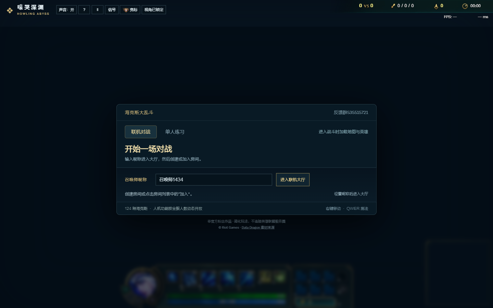
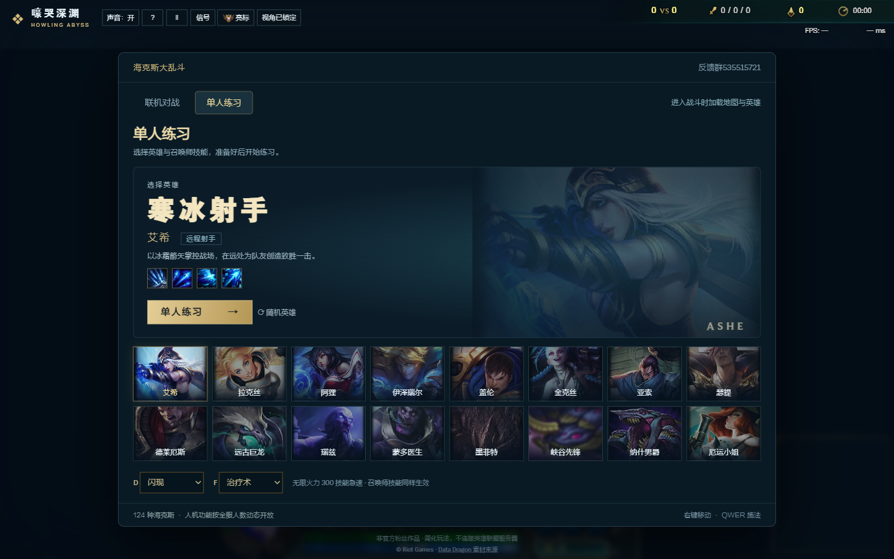
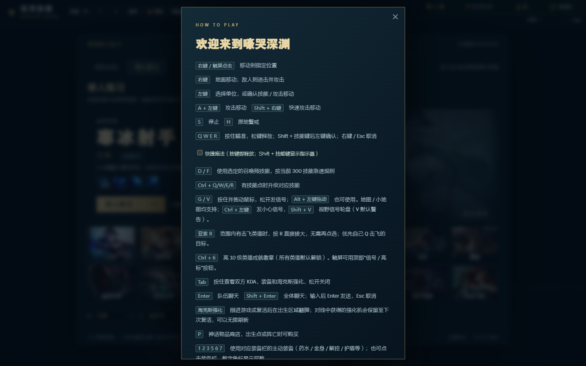
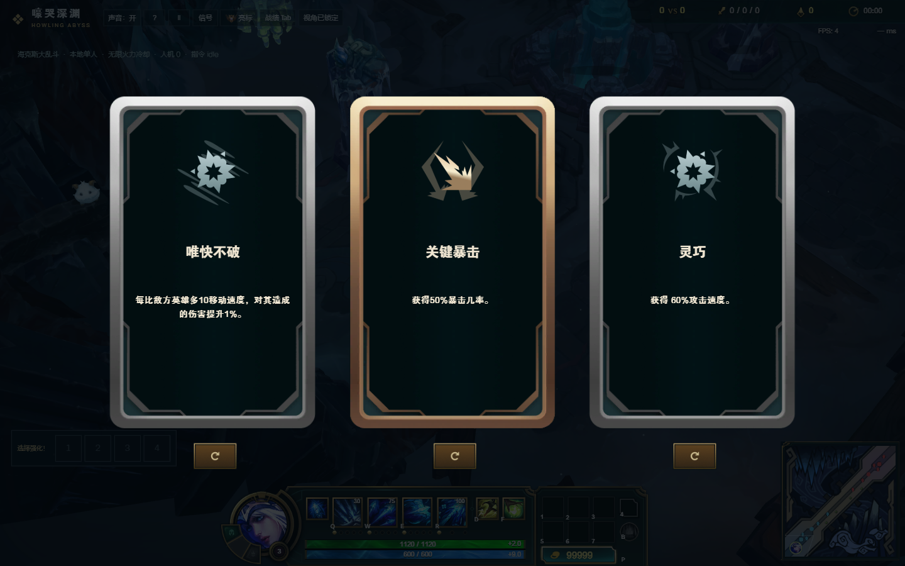
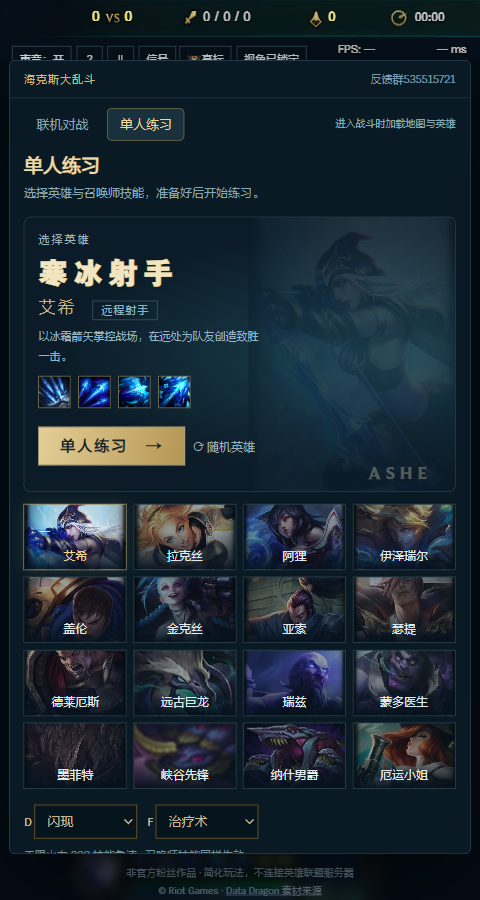

# 嚎哭深渊 · 海克斯大乱斗 — 本地镜像

> 这是 [lol.hanyue.io](https://lol.hanyue.io/) 的 1:1 本地复刻：完整保留原站 DOM、CSS、
> 游戏 bundle（2.6MB）和全部静态资源（立绘、3D 模型、音效、HUD 图集、海克斯强化图标、地图纹理）。
> 仓库以轻量形式发布 —— **运行所需的 119MB 资源未入版本控制**，按下方"首次运行"指引一键拉取即可。



---

## 📑 目录

- [项目简介](#项目简介)
- [快速开始](#快速开始)
- [界面一览](#界面一览)
- [操作手册](#操作手册)
- [目录结构](#目录结构)
- [功能对照](#功能对照)
- [实现说明](#实现说明)
- [已知差异](#已知差异)
- [License / 致谢](#license--致谢)

---

## 项目简介

| 项目 | 内容 |
| --- | --- |
| 名称 | 嚎哭深渊 · 海克斯大乱斗 — 本地镜像 |
| 原站 | https://lol.hanyue.io/ |
| 类型 | 单页 Web 游戏（HTML + CSS + JS bundle + 静态资源） |
| 技术栈 | 原生 WebGL / Canvas / Three.js（已编译进 bundle） |
| 服务器 | `serve.py`：~60 行 `ThreadingHTTPServer`，自定义 MIME + 不可变缓存 |
| 依赖 | Python 3.7+（无第三方包） |
| 浏览器 | Chrome / Edge / Firefox / Safari，含移动端响应式 |
| 资源大小 | 2717 个文件，约 119MB（首次运行按脚本自动拉取） |

---

## 快速开始

### 1. 克隆仓库

```bash
git clone https://github.com/xuzeyu91/lol_web.git
cd lol_web
```

### 2. 拉取游戏资源（首次必需，约 119MB / ~2700 个文件）

> 仓库仅跟踪代码与配置文件；游戏所需的地图、模型、音效、贴图等大型静态资源
> 通过 `tools/mirror.py` 从原站拉取，避免仓库膨胀。

```bash
python tools/mirror.py        # 主资源批量抓取（推荐）
python tools/extra.py         # 补漏：地图 / 控件 / 防御塔破碎
python tools/extra2.py        # 补漏：技能指示器图标
python tools/extra3.py        # 补漏：其余缺失资源
```

> 也可以从原站下载后直接放进 `static/r20260915-miss-fortune-1/assets/`；脚本失败时
> 用 `python tools/fetch.py <url>` 单点补抓。

### 3. 启动本地服务

任选其一：

```bash
# 方式 A：直接运行
python serve.py                # 默认 http://127.0.0.1:5173/
python serve.py 8080           # 自定义端口

# 方式 B：一键脚本
start.bat                     # Windows
./start.sh                     # macOS / Linux
```

打开浏览器访问 **http://127.0.0.1:5173/** ，稍等 2-5 秒加载资源即可开始游戏。

---

## 界面一览

### 大厅 — 联机 / 单人入口


### 英雄选择 — 16 位英雄 + 随机



### 操作帮助 — 按键 / 鼠标映射



### 对战 — 嚎哭深渊 / HUD / 商店


### 海克斯强化翻牌 — 每次复活 3 选 1



### 移动端响应式



---

## 操作手册

| 按键 | 作用 |
| --- | --- |
| `右键` / `A` + `左键` | 移动到指定位置 |
| `右键` | 移动；点击地面敌人则自动追击 |
| `左键` | 选择单位 / 释放技能 / 普攻 |
| `A` + `左键` | 攻击移动（只攻击敌方） |
| `Shift` + `右键` | 快速攻击移动 |
| `S` | 停止 |
| `H` | 原地警戒 |
| `Q` `W` `E` `R` | 释放技能；`Shift` + 技能键 = 智能施法；`右键` / `Esc` 取消 |
| `D` / `F` | 召唤师技能（300 技能急速下的无限火力模式） |
| `Ctrl` + `Q/W/E/R` | 升级对应技能 |
| `G` / `V` | 升级并拖动鼠标；`Alt` + 左键 = 升级 |
| `Tab` | 查看双方 KDA / 装备 |
| `Enter` / `Shift + Enter` | 聊天 |
| `Ctrl + 6` | 释放成就徽章 |
| `1` `2` `3` `4` `5` `6` `7` | 使用对应物品栏的主动装备（药水 / 金身 / 护盾等） |
| `P` | 神态物品店；点击出生点战士即可购买 |

**小地图**

| 操作 | 作用 |
| --- | --- |
| `左键单击` | 移动 |
| `右键单击` | 移动 + 自动攻击 |
| `左键双击` | 视野回到英雄 |
| `鼠标拖动` | 平移小地图 |
| `Ctrl + 左键` | 发送"小心"信号 |
| `Shift + V` | 视野信号轮盘（V 默认复位） |

**视角 / 飞行**

| 操作 | 作用 |
| --- | --- |
| `亚索 R` | 范围击飞；按住 `R` 可接大招 |

---

## 目录结构

```
weblol/
├── index.html                            # 与原站字符级一致的 HTML（CDN 路径已改写为本地）
├── serve.py                              # 本地静态服务器（自定义 MIME / 不可变缓存）
├── start.bat / start.sh                  # Windows / macOS·Linux 一键启动
├── README.md                             # 本文件
├── .gitignore
├── docs/
│   └── screenshots/                      # README 引用截图（提交到仓库）
├── static/
│   ├── bootstrap/
│   │   ├── game-r20260915-close-guard-1.js  # 2.6MB 游戏主程序（与原站字节级一致）
│   │   └── local-bootstrap.js               # 精简的本地图引导器
│   └── r20260915-miss-fortune-1/        # 首次运行由 tools/mirror.py 生成
│       ├── style.css / native-shop.css ...  # 7 个原站 CSS
│       └── assets/                          # ~2700 个静态资源（119MB）—— 不入版本控制
│           ├── map/         # 嚎哭深渊 GLTF + 二进制几何 + 导航网格
│           ├── models/      # 16 个英雄 .glb.gz + 防御塔 / 野怪 / 龙 / 男爵
│           ├── audio/       # 263 个音效 / 召唤师语音
│           ├── vfx/         # 技能特效 / VFX 帧图
│           ├── hud/         # HUD 纹理图集
│           ├── controls/    # 技能指示器、AOE / 线段 / 圆形 / 扇形图标
│           ├── augments/    # 124 种海克斯强化图标
│           ├── ui/          # 加载图、地图图标、结算界面
│           ├── healthbars/  # 血条 / 法力条 / 护盾 / 控制状态
│           ├── signals/     # 地图信号 / ping 资源
│           └── fonts/       # 字体文件
└── tools/                                # 镜像构建脚本（详见 tools/README.md）
    ├── mirror.py                         # 主批量抓取
    ├── extra.py / extra2.py / extra3.py   # 补抓脚本
    ├── fetch.py                          # 单点补抓
    ├── build_html.py                     # 重写 index.html
    ├── decode.py                         # bundle \uXXXX → 中文
    └── verify*.js / compare*.js          # Playwright 自动化验证
```

---

## 功能对照

| 原站功能                       | 本地支持 | 说明                                                                                       |
| ------------------------------ | :------: | ------------------------------------------------------------------------------------------ |
| 16 位英雄选择 / 随机 / 切英雄   |    ✅    | Ashe / Lux / Ahri / Ezreal / Garen / Jinx / Yasuo / Sett / Darius / Ryze / DrMundo / Malphite / MissFortune + 4 彩蛋 |
| QWER / D / F / 召唤师技能      |    ✅    | 与原站一致的无限火力 300 技能急速                                                          |
| 海克斯强化翻牌（每次复活）       |    ✅    | 124 种强化、3 选 1、第二次机会                                                              |
| 地图（小地图 + 大地图）          |    ✅    | 嚎哭深渊完整 3D 场景，导航网格、A* 寻路                                                    |
| HUD / 物品栏 / 商城 / 装备合成   |    ✅    | 神话装备 + 药水 / 金身 / 主动装备                                                          |
| 兵线 / 防御塔 / 水晶 / 胜利结算  |    ✅    | 12 秒一波兵线，外塔→内塔→水晶→门牙→水晶枢纽                                                |
| 信号 / Ping / Ctrl+6 成就徽章    |    ✅    | 地图与小地图均支持                                                                          |
| 国服联机（房间列表/房间码/AI）   |    ⚠️    | 前端完整；后端 `https://game-api.synctools.cn/lol` 仍走原站，单人/全功能均正常             |
| 响应式 / 移动端适配             |    ✅    | 原站所有 `@media` 断点（600/650/700/850/1000/1100、max-height 780）                       |

---

## 实现说明

* **HTML** — 与原站字符级一致，仅将 CDN 资源替换为本地路径，并写入一段精简的
  `__ARAM_ASSET_ROUTES__` 配置（指向本地 `scriptBase`），跳过原版的"多 CDN 测速 + SRI 校验"逻辑。
* **CSS** — 7 个样式表原样使用，未做任何修改。
* **JS bundle** — `game-r20260915-close-guard-1.js` 与原站字节一致（2.6MB / gzip 后 625KB）。
  本地 `local-bootstrap.js` 复刻了原版 `cdn-auto` loader 的契约：
  写入 `<base href>`、暴露 `__ARAM_GAME_API_ORIGIN__`、注入主 bundle、失败时弹出错误面板。
* **资源** — 全部从原站拉取（详见 `tools/mirror.py`）。`.glb.gz` 模型按 HTTP 字节流提供，
  bundle 内部通过 gzip 魔数嗅探 + `DecompressionStream` 解压。
* **本地服务器** — `serve.py` 是 60 行的 `ThreadingHTTPServer`：
  - 显式 MIME（`.glb` / `.gz` / `.woff2` / `.mp3` 等）
  - `/static/**` 设 1 年 immutable 缓存
  - 根路径默认 `no-cache`
  - 子进程异步，典型响应 < 200ms

---

## 已知差异

* **FPS** — 在不支持硬件加速的环境（如 SwiftShader / WSL）下，地图与技能特效帧率较低。
  真实浏览器 / 显卡环境下表现与原站一致。
* **联机对战** — UI 完整，但房间数据需要远端 `game-api.synctools.cn` 服务（与原站共用）。
  单人练习 / 海克斯强化 / 商城 / 全部 PvE 玩法均可离线使用。
* **彩蛋英雄立绘** — Leona / Morgana / Veigar 的原画在原站同样缺失（仅有图标，无 `-loading.jpg`），
  保留原样。
* **git 仓库体积** — 仅跟踪代码与配置（≈ 4MB）；运行所需的 119MB 静态资源不入版本控制，
  通过 `tools/mirror.py` 一键拉取。

---

## License / 致谢

非官方粉丝作品，简化玩法，不连接英雄联盟服务器。

所有素材来源：
- 原站 [lol.hanyue.io](https://lol.hanyue.io/)
- [Data Dragon](https://developer.riotgames.com/docs/lol)

© Riot Games · 本项目仅用于学习与本地化复刻，请勿用于商业用途。